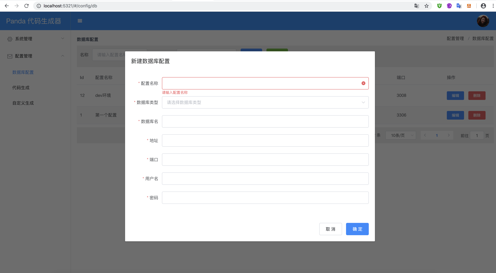

### Web版Mybatis代码生成器

******


>   目前仅在Mysql 数据库测试通过

####    基于数据库配置生成代码


* 执行ddl(数据库配置表)

```sql

CREATE TABLE `db_conf` (
  `id` bigint(20) NOT NULL AUTO_INCREMENT COMMENT '主键',
  `name` varchar(32) NOT NULL COMMENT '配置名称',
  `db_name` varchar(32) NOT NULL COMMENT '数据名',
  `type` tinyint(4) NOT NULL COMMENT '数据类型 1-mysql  2-oracle',
  `host` varchar(32) NOT NULL COMMENT '数据库地址',
  `port` int(11) NOT NULL COMMENT '端口',
  `user_name` varchar(32) NOT NULL COMMENT '用户名',
  `password` varchar(32) NOT NULL COMMENT '密码',
  `create_time` datetime NOT NULL COMMENT '创建时间',
  `modify_time` datetime DEFAULT NULL COMMENT '修改时间',
  PRIMARY KEY (`id`)
) ENGINE=InnoDB AUTO_INCREMENT=13 DEFAULT CHARSET=utf8 COMMENT='数据库配置表';

```

* 修改项目配置

```properties


# database
spring.datasource.druid.name=spring-boot-echo
spring.datasource.druid.url=jdbc:mysql://127.0.0.1:3306/echo?useUnicode=true&characterEncoding=utf-8&useSSL=false
spring.datasource.druid.driverClassName=com.mysql.jdbc.Driver
spring.datasource.druid.username=root
spring.datasource.druid.password=123456
spring.datasource.druid.max-active=20
spring.datasource.druid.max-idle=8
spring.datasource.druid.min-idle=8
spring.datasource.druid.initial-size=10
spring.datasource.druid.maxWait=60000
spring.datasource.druid.timeBetweenEvictionRunsMillis=60000
spring.datasource.druid.minEvictableIdleTimeMillis=300000
spring.datasource.druid.validationQuery=SELECT 1 FROM DUAL
spring.datasource.druid.testWhileIdle=true
spring.datasource.druid.testOnBorrow=false
spring.datasource.druid.testOnReturn=false
spring.datasource.druid.logSlowSql=true


# server
spring.application.name=Panda
server.servlet.application-display-name=Panda
server.port=5321
debug=true

spring.jackson.date-format=yyyy-MM-dd HH:mm:ss


# host
server.host=localhost

download.prefix=http://${server.host}:${server.port}/generate/down?file=

```
* 编译并启动应用

```jshelllanguage

mvn clean install 

cd panda-web/target/panda-web-1.0.jar

java -jar  panda-web-1.0.jar

```

* 打开控制台(http://localhost:5321)添加数据库配置



* 生成指定的代码
    
    1. 点击左侧(代码生成)菜单 
    2. 输入生成的对应的包名
    3. 选择对应的数据库配置
    4. 点击加载表信息来加载表数据信息。
    5. 勾选您要使用的表。
    6. 点击生成代码即可生成。


####    非依赖数据库配置生成代码

---------

* 点击左侧自定义生成菜单 添加数据表


* 点击添加字段信息


* 输入生成的对应的包名点击生成代码即可。


####    其他

>   如果不想使用web控制台版请移步[AutoGenerator](https://github.com/av1900/AutoGenerator)


